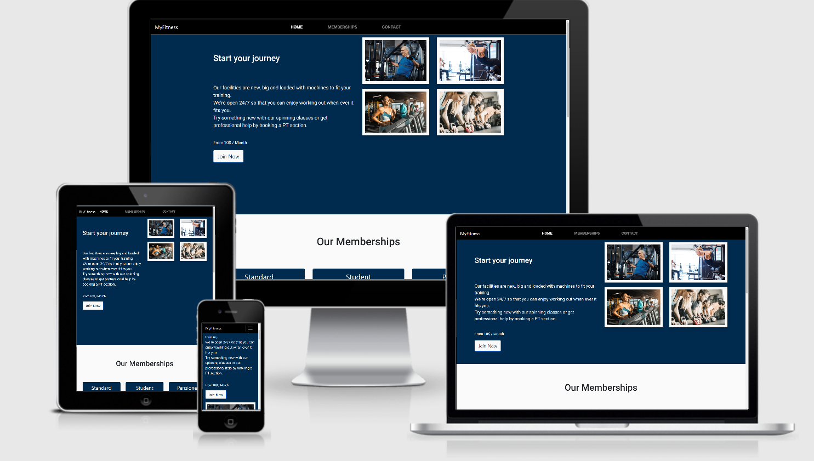
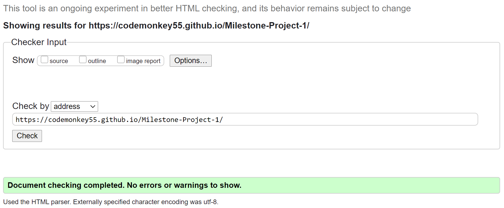
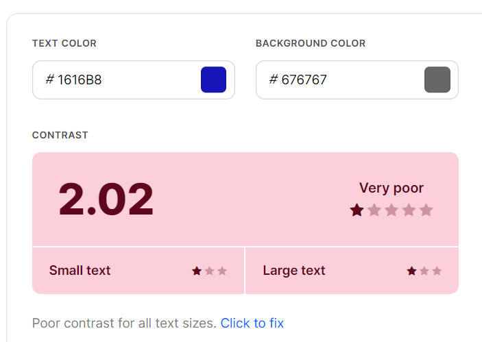
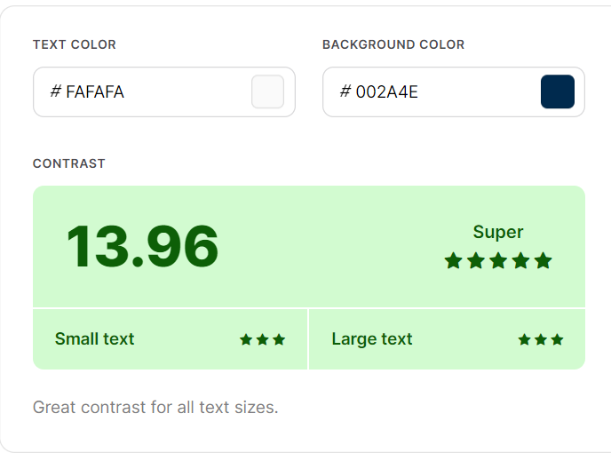
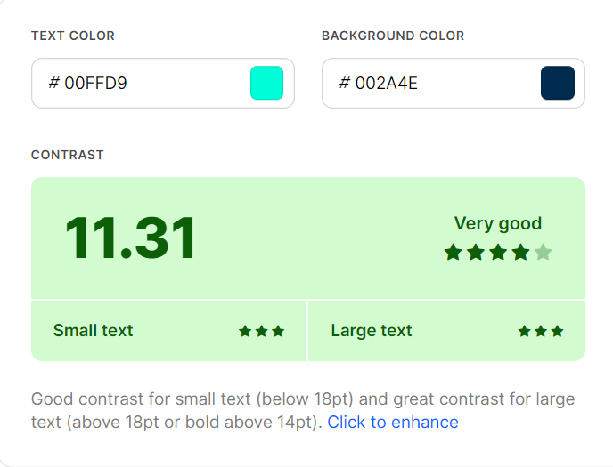

# MyFitness

## Code Institute MS1 Project in User-Centric Frontend Development 
The brief was to develop a static front end project with a minimum of three separate page areas using HTML and CSS while following UX industry conventions. This website is created for educational purposes.

[View website in GitHub Pages.](https://codemonkey55.github.io/Milestone-Project-1/) 
 
 
 
Image produced from [Am I Responsive](http://ami.responsivedesign.is)

## [MyFitness](https://codemonkey55.github.io/Milestone-Project-1/) 

The website is created to showcase a newly opened gym in the LA area and to get both new and experienced gym-people to get a insight into what its like. 

The site features an intro section, a section with all the memberships available, an contact form where you can get in touch with personel about any questions as well as a footer with further information.

The primary goal with the website is to get the users attention towards memberships and for them to purchase one. While the aspect of getting people to join the gym, a big part is also about sponsors and business partners, therefor the contact page is where you as a sponsor or regular user can submit questions which is easily accessable.

**The business goals of this website are:**

- To get potential sponsors or business partners to help the gym grow.
- To increase the reach and awareness of the gym.
- To create a good connection with both sponsors and business partners.

**The customer goals of this website are:**

- To find out more information about the gym, such as location, contact info and phone number. 
- To seek out wether or not the current members of the gym enjoy their memberships and if its worth it.
- To let the customer know what the different memberships include and create a interest towards them.
- To let people easily access the different social media platforms to get a better insight of potential credibility and photos of the gym.
- To get people to come up with questions regarding the gym and to get in contact and start a conversation.

# UX

### Strategy

My strategy for the site was to provide reputable content and ease of access to users trying to attain information by utilising key UX principals.
I wanted to incorporate the majority of elements from [Peter Morville's UX Honeycomb](https://books.google.ie/books?id=yLd9DwAAQBAJ&lpg=PA6&dq=ux%20honeycomb%20peter%20morville&pg=PR1#v=onepage&q=ux%20honeycomb%20peter%20morville&f=false) to create a great experience for the user. In particular, I believed that the aspects of "Credible", "Valuable" and "Usable" were highly significant to implement in this project. I felt that the owner images and client list would add to the credibility of the company and the overall site.   

#### Ideal users of this website:
- Newbie's
- Fitness Enthusiasts
- Sponsors/Business Partners

#### These users are looking for:
- A good, well-rounded gym with proper equipment and reasonable prices.
- An easy way to contact the gym regarding questions about anything. 

#### This project is the best way to achieve their goals because:
Most gym/fitness sites seem to focus a lot on throwing in as much information and clutter up the website before the user has a chance to look around. This creates confusion and leaves a bad feeling. With this website the user can easily navigate throughout the page and find either memberships or get in contact right away.

#### User Stories

1. **_Fitness Enthusiasts,_** I want to get a good look at a few parts of the gym via images before going there.
2. **_Fitness Enthusiasts,_** I want to make sure the gym has a good reputation and all around good equipment that matches my type of training.
3. **_Fitness Enthusiasts,_** I want to be able to access the gym at any time of the day so that it fits my workout routine.
4. **_As a Newbie,_** I want to get the best price possible when starting out at a gym, as well as fun things included into the membership.
5. **_As a Newbie,_** I want to have a personal trainer to help me get going during my first times at the gym.
6. **_As a Sponsor/Business Partner,_** I want to get in touch easily to discuss pricing and other questions regarding the company. 
7. **_As a Newbie/Fitness Enthusiasts/Sponsor/Business Partner,_** I want to see more than one type of contacting the gym to make it easier to start the conversation depending on what i prefer.

### Scope
To achieve the strategic goals, I wanted to include the following features in this production release:
- **Header** containing company logo and navigation bar
- **Home/Introduction** showcasing people enjoying their time at the gym through pictures as well as containing some good-to-know info
- **Memberships** letting the user know what the different memberships include as well as pricing
- **Contact Form** making it easy for sponsors or regular users to contact the gym regarding any questions they have
- **Footer** containing links to social media, phone number and email

### Structure 

I decided to create a single-page website to simply everything for the user, adding nothing but the necessary features.
To begin with we have the nav-bar which contains the three different sections. The company logo is placed on the left side and is displayed in a clean, simple way to both suite the site but also let the users familiarize themselves with it.
This type of structure would let the user easily navigate through the page with ease.
The links are placed in a specific order to make the user follow the different steps. Starting with the Home/Introduction where you get a couple of pictures of the gym and some simple info to catch the users interest. By either continuing down the site or clicking the "Join Now" button, the next part of the site will become visible and let the user look through memberships. From here on depending on what the users needs are, there is a contact form for further questions or a footer at the bottom for more information on how to contact the company.
 
### Skeleton
- [Wireframes](assets/wireframes/wireframes.pdf "Myfitness Wireframes"): Website contains 4 sections; Home (Introduction), Memberships (Our Memberships) and a Contact form (Contact Us) section. At the beginning i wanted to have a 4 page layout but decided that this would only make things more complicated, and stuck to a more simple design.
**Please note the finalised website contains some variations to the original wireframe**

### Surface 

The logo of the company features a simple white text on a black background for good contrast. 
The blue/white button seen both at the beginning of the page and at the membership section, is there to both create contrast and to direct the users attention instantly.
All throughout the website i wanted to keep it simple with easy colours. The blue, white and black makes good contrast with the buttons as mentioned. No unncessesary clutter or any extra parts have been added to the sections to keep a simple and nicely flowing design for good user experience.
I used both Roboto and Exo as fonts because i think they fit this type of site well, with Sans-serif as back up fonts as this is a well fitting font all around.

# Features

This fully responsive website consists of a header, footer and three sections that are the following; Home (Introduction Section), Memberships (Our Memberships) and a contact form. The different sections has proper heading and sub-heading for the user to easily navigate through it and create a good design. In the navigation section i used hover classes to get a nice simple effect which adds to the user experience. The use of icons in the footer is to create a nice look with clear target to the different sites. I used both Scrollspy and the Bootstrap Plugin, the scroll to update the navigation list depending on the users current position in the site, and the bootstrap plugin for all of its great features. I decided to use a fixed nav-bar at all screen sizes to make the user feel comfortable navigating down the site and always being able to change direction. On smaller devices i used the so call "Hamburger icon" or the collapse menu to make the nav-bar look better and to not get the navigation section so cluttered up. 

**Header:**
The header features a navigation bar which is fully responsive with links directing to each section and with the company logo on the left hand side of the screen. As mentioned before the nav-bar is fixed and in place which fits very well with a one-page website and is one of the reasons why it is the way it is.

**Home (Introduction):** 
The home section is for the user to get a quick look at some part of the gym via four images on the right hand side. These images showcase people enjoying their time at the gym and the purpose of them is to let the user have a look into the gym before actually visiting them and to create a genuine feeling for it.
On the left hand side the user can read a few lines of introduction information about the gym and some things that are good to know. They also have the ability to click the Join Now button to get redirected further down to the next section.

**Memberships (Our Memberships):**
This is where the different memeberships are displayed and the user gets a good idea of what each membership include as well as the price of them.
There is a membership created to fit all people, each membership have different extras that comes with them and depends on who its fitted for.

**Contact Form:** 
Eventually the user will make its way down to the contact form, this is where they can ask any questions regarding memberships, about the gym or if a possible sponsor wants to hook up about business ideas. 
This part of the site is essential and creates a comfortable feeling and brings more people in to ask about the gym.

**Footer:**
This section of the site is the last thing the user sees. If the user doesnt feel like filling out the form or that the individual hasnt gotten their needs fulfilled, they can use other contact options or go check the different social media links to hopefully find what they are looking for.

### Features Left to Implement
Due to time restraints, I was not able to implement all the features i would've wished for but could be a potential future update:
- More photos of the gym in detail to showcase what it looks like to bring more people around.
- A Login / Sign Up form where you can register as a user with your email, address and name to get access to more personal things and change your own membership.
- A section showcasing all gym's available in the world with addresses, phone numbers etc, to let more users across the world access the facilities.

# Technologies Used

In the construction of this project I have utilised the following languages, frameworks, libraries and tools:
- **HTML5,** **CSS3**, **JavaScript** programming languages
- [Bootstrap v4.5.3](https://getbootstrap.com)
    - The project used **Bootstrap** to make the website a lot more simple to work on. The cards as well as the footer for example were very good samples from bootstrap and customized to fit the page.
- [GitPod](https://www.gitpod.io/)
    - I used **GitPod** as the platform for this project. Gitpod has a lot of great help tools and easy ways to both commit through code or via the explore tab.
- [GitHub](https://www.github.com/)
    - This project used **GitHub** as the host of all my code and is where all the gitpod content was pushed to.
- [Balsamiq](https://balsamiq.com/)
    - I used **Balsamiq**, its a great and easy way to create a sketch of your project and to get a good view of the structure.  This also helped a lot to get the UX part set to a good start and to make a quick version of the website on all screen sizes.
- [Chrome Dev Tools](https://developers.google.com/web/tools/chrome-devtools)
    - **Chrome Dev Tools** was used to test the site, build , and use lighthouse. It has been of big help to be able to edit the code in the dev tools to get the site right and then transfer that over to the actual code.
- [Google Fonts](https://getbootstrap.com)
    - **Google Fonts** was used to style the website fonts.
- [Font Awesome](https://fontawesome.com/)
    - I used the font & icon toolkit **Font Awesome** in the footer section to let the user easily understand the link they would get redirected to if clicked.
- [TinyPNG](https://tinypng.com)
    - I used the **TinyPNG** website to reduce the size of my images and to let the website run faster and to get better performance out of it.
- [Freeformatter CSS Beautify](https://www.freeformatter.com/css-beautifier.html)
    - The **CSS Beautify** site was used to format and automatically indent my CSS file.
- [Freeformatter HTML Formatter](https://www.freeformatter.com/html-formatter.html)
    - The **HTML Formatter** was used to format the HTML document.     
- [Color Contrast Validator](https://coolors.co/)
    - The **Color Contrast Validator** was used to test for colour contrast on the project.
- [W3C Markup Validation Service](https://validator.w3.org/)
    - The **W3C Markup Validation Service** is the site i used to check the validation of the html.
- [W3C CSS Validation Service](https://jigsaw.w3.org/css-validator/)
    - **W3C CSS Validation Service** was used to check the validity of my CSS in the project.

# Testing

## UX stories testing

**As a Newbie/Fitness Enthusiasts/Sponsor/Business Partner,: I would like to have a first glance of the gym when opening the page as well as some simple information**

At the first part of the site, there is four pictures displayed on the right to let the users get a simple first look at how the gym looks now. In addition to this, there is some simple but good information on the left hand side of the screen to create some comfort for the user.

**As a Newbie/Fitness Enthusiasts/Sponsor/Business Partner,: I want to make sure that the gym has a good reputation before starting anything with them**

The easiest way for any user to know about the gym's reputation and progression is to use the links placed in the footer at the bottom of the site, this is where they can find out what other members of the gym thinks of it and how it is to work with.

**As a Newbie/Fitness Enthusiasts/Sponsor/Business Partner,: I want get in touch easily with the gym regarding questions about anything**
   
This is where the contact form comes in hand for anyone regarding questions whether its about business ideas or general quetions regarding memberships, pricing etc.

**As a Newbie/Fitness Enthusiasts/Sponsor/Business Partner,: I want to be able to contact the gym no matter what time it is**

The gym has a 24/7 customer support which will answer all of your questions, this is to fit your daily routine and to once again make it more simple for the user.

**As a Newbie/Fitness Enthusiasts/Sponsor/Business Partner,: I want to more than one contact option available**

In the footer section at the bottom , you have the option to either contact the gym by mail, phone or by visiting the gym yourself. The address of the gym is also included within the footer section.

## Validation
I used the [W3C Markup Validation Service](https://validator.w3.org/) to check the HTML part of the site and [W3C CSS Validation Service](https://jigsaw.w3.org/css-validator/) to check the CSS validity of the site.

The site passed through the validation sites.

The [Color Contrast Accessibility Validator](https://coolors.co/) was used under the project to make sure contrasts were good.

I found out that my background color throughout some parts of the page wasnt adding up with the color of my buttons.

I decided to go ahead and change the grey color to a more darkblue color and also change the background of one of my buttons to white.

What i also decided to do was to give one of the buttons a very good contrast when hovered, this makes the button still easily readable while hovered against the dark background.

I did a lot of work in [Chrome Dev Tools](https://developers.google.com/web/tools/chrome-devtools) and ran lighthouse every now and then to make sure my site was working at a optimal level. 

The lighthouse reports showed good results throughout the project. One thing that made the accessibility a bit bad was that i didnt have labels added which i added quickly and then got these results out of it.

The links with the "hover" effects works very well and all the links to social media platforms etc are opened in a new window due to "_blank".

# Deployment

This site is hosted via github pages, it is deployed directly from the master branch. The site that has been deployed will automatically update when there are new commits to the master branch. The landing page must be named index.html or the site will not deploy correctly on the Github pages.

To run this locally, you could clone this repository into a editor of your choice directly by pasting git clone https://codemonkey55.github.io/Milestone-Project-1 into your terminal. If you want to cut ties with this Github repository, you can simply type remote rm origin into the terminal.

My project was developed using the IDE, Gitpod. I deployed my website from the GitHub repository to GitHub Pages using the following steps:

1. First i selected the Settings tab in my GitHub repository.

2. After this i located the Github pages section and then chose the master branch as the source to enable Github Pages.

3. Once i saved Master Branch as the source , the page then refreshed and i could quickly locate the URL to the deployed site.

4. Then what i did is simply follow the link to verify and take a look at the published GitHub page.

# Credits

### Content
The cards from the membership section as well as the footer was adapted from:
- the [Bootsrap pricing example](https://getbootstrap.com/docs/4.0/examples/pricing/)
- the [Mockplus blog post](https://www.mockplus.com/blog/post/bootstrap-4-footer-template)

 
### Media
 The images used in this site were obtained from the following sources:

- Introduction image 1 - [from Medley.se](https://www.medley.se/vart-utbud/gym)
- Introduction image 2 - [from Kockumfritid](https://kockumfritid.se/aktivitet/gym/)
- Introduction image 3 - [from Istockphoto](https://www.istockphoto.com/se/fotografier/gym)
- Introduction image 4 - [from Istockphoto](https://www.istockphoto.com/se/fotografier/gym)

### Acknowledgements

I decided to develop this project to make something for a possible future client of mine within the fitness industry. Not a finished product for a full-out fitness website by any means but has some good potential.

I took inspiration from these sources however I did implement my own custom code with each snippet as well:
- Bootstrap was used to implement [Scrollspy](https://getbootstrap.com/docs/4.5/components/scrollspy) for the Navigation and for my contact form i took inspiration from the [Contact Form](https://getbootstrap.com/docs/4.0/components/forms/#form-groups) examples on bootstrap
- During the development i was struggling to make some good looking cards and eventually decided to take inspiration from a bootstrap example which i customized [Bootstrap Example](https://getbootstrap.com/docs/4.0/examples/pricing/)
- In order to make my footer work as good as possible, I took inspiration from [Mockplus](https://www.mockplus.com/blog/post/bootstrap-4-footer-template)
      
Finally, I would like to thank Jim Morel on Slack for his amazing help all around with struggles through the project and always looking after me. I would also like to thank my great mentor Guido Cecilio for all the support he gave me and our great meetings through everything.